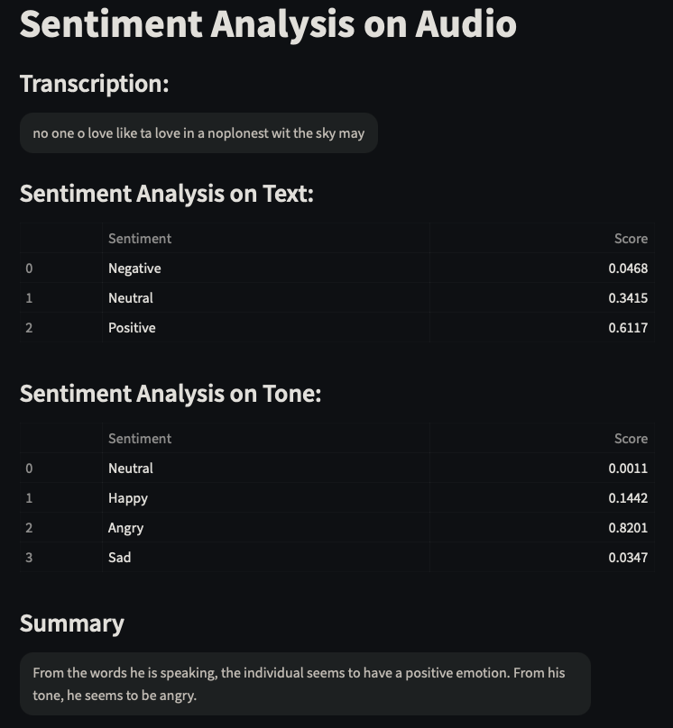

# Sentiment Analysis on Audio

Perform sentiment analysis on audio files. The main components of the project are `app.py` and `utils.py`.

Try out the streamlit app [here!](https://suniljit-sentiment-analysis-on-audio-app-aztkvt.streamlit.app/)

Note: The video upload is not supported on streamlit cloud as it does not have the ffmpeg package installed. 

## Overview
Two types of sentiment analysis will be performed:
1. **Text-based sentiment analysis**: The audio file will be transcribed to text using Wav2Vec2. 
2. **Tone-based sentiment analysis**: The audio file will be analyzed for tone using Wav2Vec2. 

## Getting Started

### Prerequisites
Make sure you have the following installed:
- Python 3.x
- Required Python packages (listed in `requirements.txt`)
- Install ffmpeg using homebrew: `brew install ffmpeg`

### Usage
Run the main application script:
```sh
streamlit run app.py
```
You can input either audio or video files for sentiment analysis. 

## Models
The models used in this project are:
* Speech to Text: [Wav2Vec2](https://huggingface.co/facebook/wav2vec2-base-960h)
* Textual Sentiment Analysis: [Twitter roBERTa for Sentiment Analysis](https://huggingface.co/cardiffnlp/twitter-roberta-base-sentiment-latest)
* Speech to Tone and Tonal Sentiment Analysis: [Wav2Vec2 for Emotion Recognition](https://huggingface.co/superb/wav2vec2-base-superb-er)

## Results
In the example below, we fed an audio clip of Ice Cube saying some nice things but in an angry voice. While the Wav2Vec2 model was not able to detect the words he said well (the words said was "I want a love like the love in the notebook, a love that splits the sky"), it detected the key word "love" multiple times, allowing the sentiment model to classifiy the sentiment as positive. <br>

However, the Wav2Vec2 model was able to detect his tone an angry rather clearly. 



## Future Work
The following could be done in the future to improve the project:
* Use a better model (e.g. Whisper) for speech-to-text conversion
* Integrate microphone audio input for real-time sentiment analysis
* Integrate YouTube URL links as an input source (at this time, all the YouTube APIs I tested were not functional, except for the transcripts API)